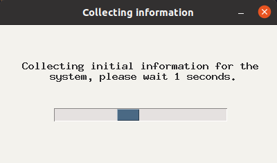
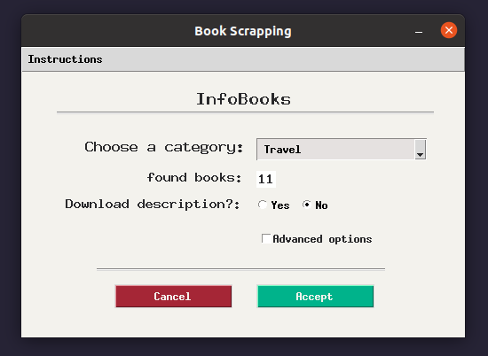
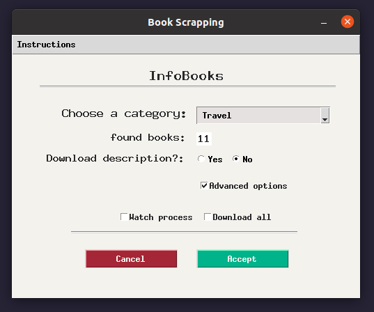
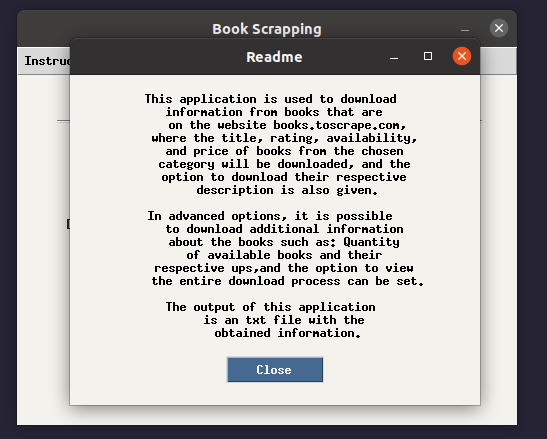

# Book Scrapping

This is a desktop application that uses a graphical interface to perform web scraping on the website 'http://books.toscrape.com/'. The application offers different options for custom download, such as the category of the books, as well as the ability to download descriptions and the number of books available per title.

This project provides a brief demonstration of the things that can be done through web scraping for information gathering, as well as automation of web processes.

**Note:** The output of this application is a txt file with the requested information in the path where the main.py script was executed.

## Libraries used
These are the main libraries used for this project:

* Selenium
* Tkinter
* Multiprocessing

For more details, please refer to the requirements.txt document.

## Images

    
    
    
    

## Installation
To use this project, you need to have Python 3 installed on your system. We recommend creating a virtual environment for the project and installing the required libraries using the requirements.txt file provided.

To create a virtual environment and install the required libraries, follow these steps:

1. Clone this repository to your local machine.
> git clone https://github.com/viamazoba/Scraping_books.git

2. Navigate to the project directory.
> cd  Scraping_books

3. Create a virtual environment.
> python3 -m venv env

4. Activate the virtual environment.
> source env/bin/activate

5.Install the required libraries using pip.
> pip install -r requirements.txt

> This will install all the required libraries with their corresponding versions specified in the requirements.txt file.

6. After installing the required libraries, you can run the project using the following command:
> python main.py